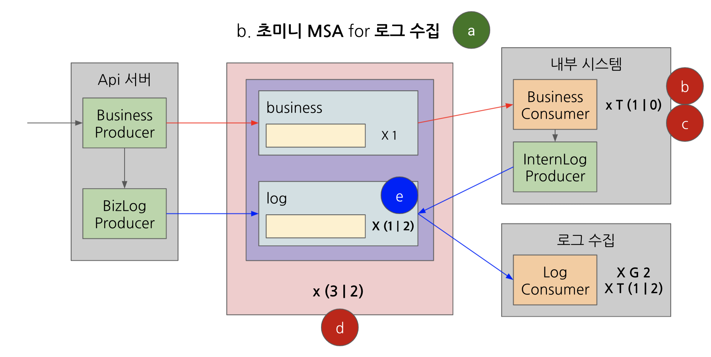

# learning-kafka

카프카 학습을 위한 아주 작은 개인 프로젝트입니다. \
오류가 있는 경우 알려주시면 감사하겠습니다.

## 구성하기

- 이 프로젝트 clone (docker-compose.yml을 포함)
  - 참고: [docker-compose 설정파일 모음](https://github.com/conduktor/kafka-stack-docker-compose)
- 카프카 다운로드 및 환경변수 설정  
  cli를 사용하기 위한 다운로드입니다. 카프카 자체는 도커로 실행할 예정이므로, 로컬에서 카프카를 실행하시면 포트가 중복됩니다.
  

``` shell
# 프로젝트 루트 경로에서

# 주키퍼 1 & 카프카 3 등...
docker-compose up -d

# 토픽 생성 (비즈니스 & 로그)
kafka-topics \
--zookeeper localhost:2181 \ 
--replication-factor 3 --partitions 1 \
--create --topic business
  
kafka-topics \
  --zookeeper localhost:2181 \ 
  --replication-factor 3 --partitions 1 \
  --create --topic log
```

- `localhost:8000`(topics ui)에서 토픽 상태 확인

## 시나리오

카프카 클러스터와 api-server, internal-system, log-collector를 모두 실행한 뒤,  
각 서브 프로젝트 test 폴더의 http 요청으로 관련 동작을 발생시키고 로그 및 토픽의 상태를 확인합니다.



a. 정상 시나리오

- **2Group x 1Consumer가 BizProducer와 BizConsumer의 로그를 수집한다.**
- 데이터 생산: api-server의 a_normal.http

b. 장애 시나리오 1 : 컨슈머 중단

- **BizConsumer가 중단되었다가 재시작하면 그 사이 쌓여있던 메시지를 빠짐없이 가져온다.**
- 컨슈머 중단/실행: internal-system의 b_consumer_run_control.http

c. 장애 시나리오 2 : 커밋 전 실패

- **BizConsumer가 커밋을 하지 않으면, 다음 메시지로 넘어가지 않는다.**  
  본래 오프셋 관리자는 파티션이다.  
  그러나 실제 구현 측면에서는 KafkaConsumer 역시 오프셋을 관리하여, 지속적인 컨슈머라면 다음 메시지로 넘어간다.  
  만일 새 컨슈머로 토픽을 폴링한다면, 커밋되지 않은 메시지를 모두 가져온다.
- 컨슈머 커밋 설정: internal-system의 c_consumer_set_control.http

d. 장애 시나리오 3

- **리더 브로커를 종료해도, ISR이 리더를 승계하여 이상없이 동작한다.**
- `localhost:8000`의 business 토픽 > 파티션 탭에서 현재 리더 브로커를 확인한다.  
  도커에서 리더 브로커를 정지시키고, topics ui에서 리더가 변경되었음을 확인한다.  
  다시 데이터를 생산하고 정상 동작하는지 확인한다.  
  브로커를 다시 실행하면 클러스터에 포함되며 in-sync 상태가 된다.(리더 자격은 복귀되지 않는다.)
  
e. 성능 시나리오

- **파티션과 컨슈머를 추가하면, 더욱 빠르게 동작한다.**
- 파티션을 추가하고, topics ui에서 상태를 확인한다.
  ``` shell
    kafka-topics \
      --zookeeper localhost:2181 \
      --alter --topic business \
      --partitions 2
  ```
- 로그 컨슈머 추가: log-collector의 e_add-thread.http
- 로그 대량 생산: api-server의 e_iter.http
- 성능을 비교한다.
  ``` shell
  ==========
  > log-consumer-1 group process 1000 data in 650 ms.
  ==========
  # ...
  ==========
  > log-consumer-2 group process 1000 data in 1299 ms.
  ==========
  ```